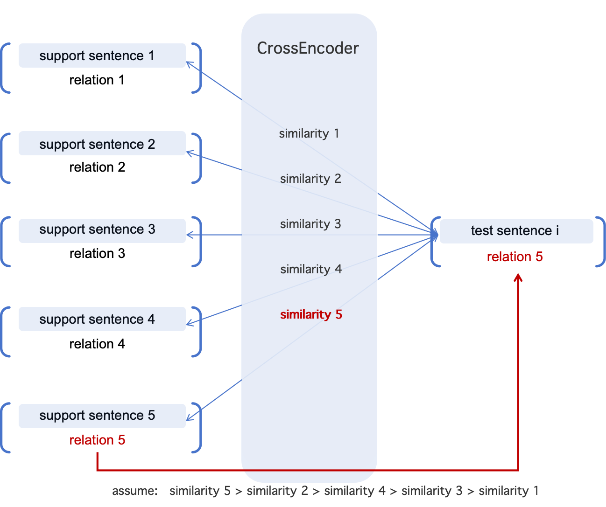

Welcome to my NLP modeling project on the **TACRED** dataset. 

This project implements a sentence-pair modeling approach to tackle the relation extraction task on the TACRED dataset, using `CrossEncoder` models from the `sentence-transformers` library.

## 🧠 Task Overview

**Relation extraction** is a fundamental task in text analysis and a cornerstone for building knowledge graphs, which in turn support many downstream applications. Given its importance and the need for efficiency, lightweight baseline models with simple architectures are well-suited for this task. In this project, I aim to explore methods, frameworks, and techniques to enhance such models. Specifically, I focus on improving a **sentence-pair classification** baseline for relation extraction. 

*As part of this course project, I only present a reproduction of the sentence-pair baseline.*

## 📂  Overall flow of this work

First, we adopt the sentence-pair architecture for the relation extraction task. In this framework, the model predicts the relation of a test sentence by comparing it to support sentences with known relation labels. The underlying assumption is that if two sentences are semantically similar, they are likely to express similar relations.

Next, we choose the one-shot TACRED dataset as our training and evaluation resource. The one-shot setting simulates low-resource scenarios, where each task contains a single labeled example per relation. This episodic format is suitable for exploring few-shot learning. The dataset is adapted from the original TACRED (The TAC Relation Extraction Dataset, which is from the paper https://direct.mit.edu/tacl/article/doi/10.1162/tacl_a_00392/106791/Revisiting-Few-shot-Relation-Classification).

After selecting the dataset, we preprocess the one-shot TACRED dev split according to the sentence-pair framework. This involves generating a train dataset (composed of labeled support sentences) and a val dataset (containing test-support pairs) suitable for training and evaluating the model.

Finally, we use precision, recall, and F1 score as evaluation metrics to measure the gap between the predicted relation and the gold relation, providing a comprehensive assessment of the model’s performance.

## 📟 Modeling Details

We use `CrossEncoder` model (e.g., `cross-encoder/ms-marco-MiniLM-L-6-v2`) and fine-tune it using sentence pairs labeled as same-relation (1) or different-relation (0).

Architecture Choice: 

* Sentence Pair Relation Extraction

Based on the following assumption:

* If a test sentence is semantically similar to a support sentence, they are likely to share the same relation.

Therefore, for each test sentence,   it is paired with multiple (for TACRED dataset is five) support sentences, and the `CrossEncoder` model is used to:

- Compute the similarity between the test sentence and each support sentence.

Then, code will use the relation of the support sentence with the highest similarity with test sentence as the relation of this test sentence.

**Illustration of the underlying principle：**

## 📂  Dataset Selection & Preprocessing

Dataset: One-shot TACRED

- We select the **one-shot TACRED** dataset as the training and evaluation resource.

- About the **TACRED**:

  The original TACRED dataset (https://nlp.stanford.edu/projects/tacred/).

  The few-shot TACRED dataset (https://direct.mit.edu/tacl/article/doi/10.1162/tacl_a_00392/106791/Revisiting-Few-shot-Relation-Classification)).

Meta Data of One-shot TACRED: one episode of One-shot TACRED

Click to expand JSON example of one episode

<pre style="font-size: 12px;">
{
    "meta_train": [
      [
        { // support sentence 1
          "relation": "",
          "token": [
          ],
          "subj_start": ,
          "subj_end": ,
          "obj_start": ,
          "obj_end": ,
          "subj_type": "",
          "obj_type": "",
        }
      ],
      [
        {// support sentence 2
          "relation": "",
          "token": [
          ],
          "subj_start": ,
          "subj_end": ,
          "obj_start": ,
          "obj_end": ,
          "subj_type": "",
          "obj_type": "",
        }
      ],
      [
        {// support sentence 3
          "relation": "",
          "token": [
          ],
          "subj_start": ,
          "subj_end": ,
          "obj_start": ,
          "obj_end": ,
          "subj_type": "",
          "obj_type": "",
        }
      ],
      [
        {// support sentence 4
          "relation": "",
          "token": [
          ],
          "subj_start": ,
          "subj_end": ,
          "obj_start": ,
          "obj_end": ,
          "subj_type": "",
          "obj_type": "",
        }
      ],
      [
        {// support sentence 5
          "relation": "",
          "token": [
          ],
          "subj_start": ,
          "subj_end": ,
          "obj_start": ,
          "obj_end": ,
          "subj_type": "",
          "obj_type": "",
        }
      ],
    ],
    "meta_test": [
      {// test sentence 1
        "relation": "",
        "token": [
        ],
        "subj_start": ,
        "subj_end": ,
        "obj_start": ,
        "obj_end": ,
        "subj_type": "",
        "obj_type": "",
        ]
      },
      {// test sentence 2
        "relation": "",
        "token": [
        ],
        "subj_start": ,
        "subj_end": ,
        "obj_start": ,
        "obj_end": ,
        "subj_type": "",
        "obj_type": "",
        ]
      },
      {// test sentence 3
        "relation": "",
        "token": [
        ],
        "subj_start": ,
        "subj_end": ,
        "obj_start": ,
        "obj_end": ,
        "subj_type": "",
        "obj_type": "",
        ]
      },
    ]
  },
</pre>

Preprocessing under Sentence-Pair Framework: 

* Train:

  Only process all the (relation and tokens) units from "meta_train" as the training dataset. 

  (1) Using `typed_entity_marker_punct` to get <u>the sentence with entity markers</u>:

  * Replace the subject and object in the tokens with the entity marker like \# ^ date ^ 2003 #. 
  * Transform the tokens format into the sentence format. and return the formed sentence.

  (2) Using the <u>relation</u> from each unit directly.

  Combining (1) and (2), each episode has 5 (<u>relation</u>, <u>the sentence with entity markers</u>) pairs.

  While training the model, randomly sample two unit, if they have the same relation, give a label of 1. If they have different relation, give a label of 0.

  <u>Meta data:</u>

Click to expand JSON example of one episode

<pre style="font-size: 12px;">
  {
    "sentence": "In high school and at Southern Methodist University , where , already known as # ^ individual ^ Dandy Don # ( a nickname bestowed on him by his brother ) , @ * individual * Meredith @ became an all-American .",
    "relation": "per:alternate_names"
  }
</pre>

  

* Val:

  One episode contains five (support sentence, relation) units and three  (test sentence, relation) units. 
  I combined each  (test sentence, relation) unit with all five (support sentence, relation) units. The relations of the five sentences all are the candidate relation for this test sentence. 
  In this way, for one episode, we generate 15 ((test sentence, ts_relation), (support sentence, ss_relation), "Yes" if  ts_relation==ss_relation else "No") pair. 

  <u>Meta data:</u>

Click to expand JSON example of one episode

<pre style="font-size: 12px;">
  {
    "ts_sentence": "@ * firm * Escada @ , which employs around # ^ number ^ 2,300 # people worldwide , was forced to file for insolvency in mid August .",
    "ss_sentence": "In high school and at Southern Methodist University , where , already known as # ^ individual ^ Dandy Don # ( a nickname bestowed on him by his brother ) , @ * individual * Meredith @ became an all-American .",
    "ts_relation": "no_relation",
    "ss_relation": "per:alternate_names"
  }
</pre>

## 🧱 Training and Evaluating

Training:

* Input datasets: /generated_datasets/dev_episodes/train/all_train.jsonl
* Training process:
  * While training the model, randomly sample *two unit* from traing dataset, if they have the same relation, give a label of 1. If they have different relation, give a label of 0. 
  * Using the unit pairs dataset and `model.fit` to train model's capability of computing similar of two sentences.

Evaluating:

* Input datasets: /generated_datasets/dev_episodes/val/5_way_1_shots_10K_episodes_3q_seed_160290.jsonl
* Evaluating process:
  * Turn the  `(ss_sentence, ts_sentence)`  from each unit of val dataset to `to_be_predicted`.
  * Using the `ts_relation` as `gold`.
  * Using `model.predict` to calculate the similarity value for each  `(ss_sentence, ts_sentence)`  in `to_be_predicted` as `pred_scores`.
  * If the highest score in `pred_scores` is higher than `thresholds`, using the relation of the unit with this score as the `predicted relation`.
  * Using `tacred_score` (the unique F1 calculating method for TACRED dataset) to calculate **F1 scores** of `predicted relation` and `gold`.

## 📈 Results

under the file path: results/tacred_1shot.jsonl

Summary:

Click to expand JSON example of one episode

<pre style="font-size: 12px;">
{
	"p_tacred": 5.9 ± 0.72,
	"r_tacred": 12.86 ± 1.52,
	"f1_tacred": 8.09 ± 0.97
}
</pre>

The results for each val data file:

Click to expand JSON example of one episode

<pre style="font-size: 12px;">
{
  "evaluation_path": "generated_datasets/dev_episodes/val/5_way_1_shots_10K_episodes_3q_seed_160290.jsonl", "threshold": 0.78, "p_tacred": 6.5979381443298974, "r_tacred": 13.714285714285715, "f1_tacred": 8.909512761020883, 
}

{
  "evaluation_path": "generated_datasets/dev_episodes/val/5_way_1_shots_10K_episodes_3q_seed_160291.jsonl", "threshold": 0.78, "p_tacred": 6.197546804389929, "r_tacred": 13.852813852813853, "f1_tacred": 8.563782337198932, "
}

{
  "evaluation_path": "generated_datasets/dev_episodes/val/5_way_1_shots_10K_episodes_3q_seed_160292.jsonl", "threshold": 0.78, "p_tacred": 5.322687957418496, "r_tacred": 11.958146487294469, "f1_tacred": 7.366482504604052, "
}

{
  "evaluation_path": "generated_datasets/dev_episodes/val/5_way_1_shots_10K_episodes_3q_seed_160293.jsonl", "threshold": 0.78, "p_tacred": 6.426735218508997, "r_tacred": 14.164305949008499, "f1_tacred": 8.841732979664013, "
}

{
  "evaluation_path": "generated_datasets/dev_episodes/val/5_way_1_shots_10K_episodes_3q_seed_160294.jsonl", "threshold": 0.78, "p_tacred": 4.9603174603174605, "r_tacred": 10.608203677510609, "f1_tacred": 6.7598017124831005,
}
</pre>

## ⚙️ Environment

All the requirements packages are listed in the file: requirement.txt .

You can create the `python` env with `conda` using the following commands.

Click to expand JSON example of one episode

<pre style="font-size: 12px;">
conda create -n sentpair python=3.9 -y
conda activate sentpair

pip install numpy pandas scikit-learn tqdm

pip install torch torchvision torchaudio --index-url https://download.pytorch.org/whl/cu118

# PyTorch Lightning
pip install pytorch-lightning

# Sentence Transformers（包含 CrossEncoder、InputExample 等）
pip install sentence-transformers

# SciPy
pip install scipy

pip install datasets

pip install -U 'accelerate>=0.26.0'
</pre>

## 🖥️ Codebase Overview

Click to expand JSON example of one episode

<pre style="font-size: 12px;">
.
├── generate_data_code											# generate train and val dataset code
│   ├── entity_marker_with_reg.py					
│   ├── generate_train_val_data_tacred.py	
│   ├── generate_train_val_data_tacred.sh		# modify the arguements here and run it
│   └── __pycache__
│       ├── entity_marker_with_reg.cpython-313.pyc
│       └── entity_marker_with_reg.cpython-39.pyc
├── generated_datasets
│   └── dev_episodes
│       ├── train
│       │   ├── 5_way_1_shots_10K_episodes_3q_seed_160290.jsonl
│       │   ├── 5_way_1_shots_10K_episodes_3q_seed_160291.jsonl
│       │   ├── 5_way_1_shots_10K_episodes_3q_seed_160292.jsonl
│       │   ├── 5_way_1_shots_10K_episodes_3q_seed_160293.jsonl
│       │   ├── 5_way_1_shots_10K_episodes_3q_seed_160294.jsonl
│       │   └── all_train.jsonl							# dataset used to train
│       └── val
│           ├── 5_way_1_shots_10K_episodes_3q_seed_160290.jsonl	# dataset used to evaluate
│           ├── 5_way_1_shots_10K_episodes_3q_seed_160291.jsonl # dataset used to evaluate
│           ├── 5_way_1_shots_10K_episodes_3q_seed_160292.jsonl # dataset used to evaluate
│           ├── 5_way_1_shots_10K_episodes_3q_seed_160293.jsonl # dataset used to evaluate
│           └── 5_way_1_shots_10K_episodes_3q_seed_160294.jsonl # dataset used to evaluate
├── log
│   ├── 0506.log												# nohup training log
│   └── 20250506_2016_seedsall_k1.txt		# bash file printing training log
├── requirement.txt											# environments
├── results								
│   └── tacred_1shot.jsonl							# results
├── scripts
│   └── run.sh													# bash file to run sentence_pair.py  
└── src
    └── sentence_pair.py								# main code containing training, evaluating model
</pre>

